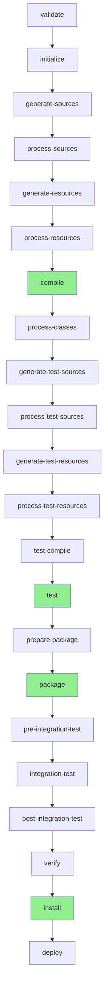
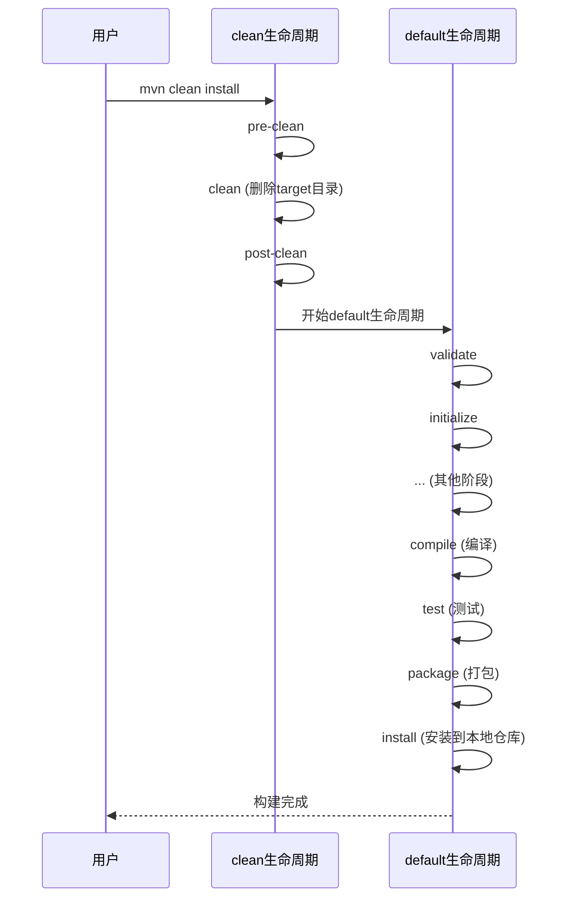

# Maven 生命周期详解

## 目录

1. [Maven 基础概念](#1-maven-基础概念)
2. [Maven 的三大生命周期](#2-maven-的三大生命周期)
3. [default 生命周期详解](#3-default-生命周期详解)
4. [clean 生命周期详解](#4-clean-生命周期详解)
5. [site 生命周期详解](#5-site-生命周期详解)
6. [常用命令详解和对比](#6-常用命令详解和对比)
7. [命令执行顺序和依赖关系](#7-命令执行顺序和依赖关系)
8. [实际应用场景](#8-实际应用场景)
9. [常见问题解答](#9-常见问题解答)

---

## 1. Maven 基础概念

### 1.1 Maven 是什么？

Maven 不仅仅是一个**依赖管理工具**，它是一个**项目管理和构建工具**。Maven 的核心功能包括：

1. **依赖管理**：自动下载和管理项目所需的第三方库（JAR 包）
2. **项目构建**：编译、测试、打包、部署项目
3. **项目标准化**：统一的项目结构和构建流程
4. **生命周期管理**：定义了一系列构建阶段，按顺序执行

### 1.2 什么是生命周期（Lifecycle）？

**生命周期**是 Maven 的核心概念之一。它定义了项目构建过程中的一系列**阶段（Phase）**，每个阶段都有特定的任务。

**类比理解**：
- 就像做菜有固定的步骤：准备食材 → 切菜 → 炒菜 → 装盘
- Maven 构建项目也有固定步骤：验证 → 编译 → 测试 → 打包 → 安装

**关键特点**：
- 阶段是按顺序执行的
- 执行某个阶段时，**会自动执行前面的所有阶段**
- 例如：执行 `mvn install` 会自动执行 `compile`、`test`、`package` 等前面的阶段

---

## 2. Maven 的三大生命周期

Maven 定义了**三个独立的生命周期**，每个生命周期都有自己的阶段：

### 2.1 default（构建生命周期）

**用途**：构建和部署项目

**最常用的生命周期**，包含从验证到部署的完整流程。我们日常使用的 `compile`、`test`、`package`、`install` 等命令都属于这个生命周期。

### 2.2 clean（清理生命周期）

**用途**：清理项目构建产生的文件

包含清理编译后的 `.class` 文件、打包后的 JAR 文件等。最常用的命令是 `mvn clean`。

### 2.3 site（站点生命周期）

**用途**：生成项目文档和站点

用于生成项目的文档站点，包括 API 文档、测试报告等。日常开发中使用较少。

---

## 3. default 生命周期详解

default 生命周期是**最常用**的生命周期，包含了项目构建的完整流程。以下是各个阶段的详细说明：

### 3.1 验证和初始化阶段

| 阶段 | 说明 | 执行内容 |
|------|------|----------|
| **validate** | 验证项目 | 检查项目结构和 pom.xml 是否正确 |
| **initialize** | 初始化 | 初始化构建状态，设置属性 |

### 3.2 源代码处理阶段

| 阶段 | 说明 | 执行内容 |
|------|------|----------|
| **generate-sources** | 生成源代码 | 生成需要编译的源代码（如代码生成工具生成的代码） |
| **process-sources** | 处理源代码 | 处理源代码，如过滤、替换等 |
| **generate-resources** | 生成资源文件 | 生成资源文件（如配置文件） |
| **process-resources** | 处理资源文件 | 复制和处理资源文件到输出目录 |

### 3.3 编译阶段（重点）

| 阶段 | 说明 | 执行内容 |
|------|------|----------|
| **compile** | 编译源代码 | **将 Java 源代码编译成 .class 字节码文件** |

**这是最常用的阶段之一**。执行 `mvn compile` 会：
- 编译 `src/main/java` 目录下的所有 Java 文件
- 将编译后的 `.class` 文件放到 `target/classes` 目录

### 3.4 测试代码处理阶段

| 阶段 | 说明 | 执行内容 |
|------|------|----------|
| **process-classes** | 处理编译后的类 | 对编译后的类进行后处理（如字节码增强） |
| **generate-test-sources** | 生成测试源代码 | 生成测试用的源代码 |
| **process-test-sources** | 处理测试源代码 | 处理测试源代码 |
| **generate-test-resources** | 生成测试资源 | 生成测试用的资源文件 |
| **process-test-resources** | 处理测试资源 | 复制和处理测试资源文件 |
| **test-compile** | 编译测试代码 | 编译 `src/test/java` 目录下的测试代码 |

### 3.5 测试阶段

| 阶段 | 说明 | 执行内容 |
|------|------|----------|
| **test** | 运行测试 | **运行单元测试**，使用测试框架（如 JUnit）执行测试 |

### 3.6 打包阶段

| 阶段 | 说明 | 执行内容 |
|------|------|----------|
| **prepare-package** | 准备打包 | 在打包前执行必要的准备工作 |
| **package** | 打包 | **将编译后的代码打包成 JAR、WAR 等格式** |

**package 阶段会**：
- 将编译后的类文件、资源文件打包
- 根据项目类型生成相应的包文件：
  - JAR 项目 → `项目名-版本.jar`
  - WAR 项目 → `项目名-版本.war`
- 包文件存放在 `target` 目录

### 3.7 集成测试阶段

| 阶段 | 说明 | 执行内容 |
|------|------|----------|
| **pre-integration-test** | 集成测试前 | 准备集成测试环境 |
| **integration-test** | 集成测试 | 执行集成测试 |
| **post-integration-test** | 集成测试后 | 清理集成测试环境 |

### 3.8 验证和安装阶段（重点）

| 阶段 | 说明 | 执行内容 |
|------|------|----------|
| **verify** | 验证 | 运行检查以验证包是否有效 |
| **install** | 安装到本地仓库 | **将打包好的文件安装到本地 Maven 仓库** |

**install 阶段会**：
- 将打包好的 JAR/WAR 文件复制到**本地 Maven 仓库**（通常是 `~/.m2/repository`）
- 这样其他项目就可以通过依赖的方式引用这个项目了
- 例如：`firmament-common` 模块打包后，`firmament-server` 模块就可以依赖它

### 3.9 部署阶段

| 阶段 | 说明 | 执行内容 |
|------|------|----------|
| **deploy** | 部署到远程仓库 | 将打包好的文件部署到**远程 Maven 仓库**（如 Nexus、Maven Central） |

### 3.10 default 生命周期流程图



**说明**：绿色标记的是最常用的阶段

---

## 4. clean 生命周期详解

clean 生命周期用于**清理项目构建产生的文件**。

### 4.1 clean 生命周期阶段

| 阶段 | 说明 | 执行内容 |
|------|------|----------|
| **pre-clean** | 清理前 | 执行清理前的准备工作 |
| **clean** | 清理 | **删除 target 目录及其所有内容** |
| **post-clean** | 清理后 | 执行清理后的工作 |

### 4.2 clean 命令详解

**`mvn clean`** 会：
- 删除 `target` 目录下的所有文件，包括：
  - 编译后的 `.class` 文件
  - 打包后的 JAR/WAR 文件
  - 测试报告
  - 其他构建产物

**为什么需要 clean？**
- 有时候代码修改后，旧的编译文件可能还在，导致问题
- 清理后可以确保重新编译，避免使用旧的编译文件
- 特别是在修改了依赖或配置后，建议先 clean 再编译

### 4.3 clean 生命周期流程图


---

## 5. site 生命周期详解

site 生命周期用于**生成项目文档和站点**，日常开发中使用较少。

### 5.1 site 生命周期阶段

| 阶段 | 说明 | 执行内容 |
|------|------|----------|
| **pre-site** | 站点生成前 | 执行生成站点前的准备工作 |
| **site** | 生成站点 | 生成项目文档站点 |
| **post-site** | 站点生成后 | 执行生成站点后的工作 |
| **site-deploy** | 部署站点 | 将生成的站点部署到服务器 |

### 5.2 site 命令说明

**`mvn site`** 会：
- 生成项目文档站点
- 包括 API 文档、测试报告、代码覆盖率等
- 生成的站点在 `target/site` 目录

**注意**：这个生命周期在日常开发中很少使用，通常只在需要生成项目文档时使用。

---

## 6. 常用命令详解和对比

### 6.1 常用命令对比表

| 命令 | 所属生命周期 | 执行阶段 | 主要作用 | 使用场景 |
|------|------------|---------|---------|---------|
| `mvn clean` | clean | clean | 删除 target 目录 | 清理项目，重新构建 |
| `mvn compile` | default | compile | 编译源代码 | 开发时快速编译检查 |
| `mvn test` | default | test | 编译并运行测试 | 运行单元测试 |
| `mvn package` | default | package | 打包项目 | 生成可部署的包文件 |
| `mvn install` | default | install | 安装到本地仓库 | 多模块项目，安装依赖模块 |
| `mvn deploy` | default | deploy | 部署到远程仓库 | 发布到 Maven 中央仓库或私有仓库 |
| `mvn clean install` | clean + default | clean → install | 清理并安装 | **最常用**，确保干净构建 |

### 6.2 命令详细说明

#### `mvn clean`

**作用**：清理项目构建产物

**执行内容**：
- 删除 `target` 目录及其所有内容

**使用场景**：
- 修改了依赖或配置后，需要重新编译
- 构建出现问题，想从头开始
- 准备发布前，确保干净构建

**示例**：
```bash
mvn clean
# 删除 target 目录
```

#### `mvn compile`

**作用**：编译源代码

**执行内容**：
- 执行 `validate` → `initialize` → `generate-sources` → ... → `compile`
- 编译 `src/main/java` 下的 Java 文件
- 生成 `.class` 文件到 `target/classes`

**使用场景**：
- 开发时快速检查代码是否能编译通过
- 不需要运行测试，只需要编译

**示例**：
```bash
mvn compile
# 编译源代码，不运行测试
```

#### `mvn test`

**作用**：编译并运行测试

**执行内容**：
- 执行 `compile` → `test-compile` → `test`
- 编译源代码和测试代码
- 运行单元测试

**使用场景**：
- 运行项目的所有单元测试
- 验证代码功能是否正确

**示例**：
```bash
mvn test
# 编译并运行测试
```

#### `mvn package`

**作用**：打包项目

**执行内容**：
- 执行 `compile` → `test` → `package`
- 编译、测试、打包
- 生成 JAR/WAR 文件到 `target` 目录

**使用场景**：
- 生成可部署的包文件
- 准备发布项目

**示例**：
```bash
mvn package
# 打包项目，生成 JAR 文件
```

#### `mvn install`（重点）

**作用**：安装到本地 Maven 仓库

**执行内容**：
- 执行 `compile` → `test` → `package` → `install`
- 编译、测试、打包
- **将打包好的文件安装到本地 Maven 仓库**（`~/.m2/repository`）

**使用场景**：
- **多模块项目**：安装子模块到本地仓库，供其他模块使用
- 例如：先 `install` `firmament-common`，然后 `firmament-server` 才能使用它

**示例**：
```bash
mvn install
# 安装到本地仓库
```

**本地仓库位置**：
- Windows: `C:\Users\用户名\.m2\repository`
- macOS/Linux: `~/.m2/repository`

#### `mvn deploy`

**作用**：部署到远程仓库

**执行内容**：
- 执行 `compile` → `test` → `package` → `install` → `deploy`
- 将打包好的文件部署到远程 Maven 仓库

**使用场景**：
- 发布项目到 Maven 中央仓库
- 发布到公司内部的私有 Maven 仓库（如 Nexus）

**注意**：需要配置 `pom.xml` 中的 `<distributionManagement>` 才能使用。

#### `mvn clean install`（最常用）

**作用**：清理并安装

**执行内容**：
1. 先执行 `clean` 生命周期：删除 `target` 目录
2. 再执行 `default` 生命周期到 `install` 阶段

**使用场景**：
- **最常用的命令**
- 确保从头开始构建，避免使用旧的编译文件
- 多模块项目中，确保依赖的模块是最新的

**示例**：
```bash
mvn clean install
# 清理后重新编译、测试、打包、安装
```

---

## 7. 命令执行顺序和依赖关系

### 7.1 阶段之间的依赖关系

**重要原则**：执行某个阶段时，**会自动执行前面的所有阶段**。

**示例 1**：执行 `mvn compile`
```
实际执行顺序：
validate → initialize → generate-sources → process-sources 
→ generate-resources → process-resources → compile
```

**示例 2**：执行 `mvn test`
```
实际执行顺序：
... → compile → process-classes → generate-test-sources 
→ process-test-sources → generate-test-resources 
→ process-test-resources → test-compile → test
```

**示例 3**：执行 `mvn install`（重点）
```
实际执行顺序：
... → compile → test → package → install
```

这意味着：
- `mvn install` **会自动执行** `compile`、`test`、`package`
- 不需要单独执行这些命令

### 7.2 组合命令的执行顺序

**`mvn clean install`** 的执行顺序：



### 7.3 跳过阶段

有时候我们想跳过某些阶段，可以使用 `-DskipTests` 参数：

```bash
# 跳过测试
mvn install -DskipTests

# 跳过测试编译和运行
mvn install -Dmaven.test.skip=true
```

---

## 8. 实际应用场景

### 8.1 日常开发场景

#### 场景 1：快速检查代码是否能编译

```bash
mvn compile
```

**什么时候用**：
- 修改代码后，想快速检查语法错误
- 不需要运行测试，只需要编译

#### 场景 2：运行单元测试

```bash
mvn test
```

**什么时候用**：
- 编写或修改测试代码后
- 想验证代码功能是否正确

#### 场景 3：多模块项目开发

假设你的项目结构如下：
```
firmament-take-out/
├── firmament-common/     (公共模块)
├── firmament-pojo/       (实体类模块)
└── firmament-server/     (服务模块，依赖上面两个)
```

**开发流程**：

1. **修改了 firmament-common 模块**：
   ```bash
   cd firmament-common
   mvn clean install
   ```
   安装到本地仓库，供其他模块使用

2. **修改了 firmament-pojo 模块**：
   ```bash
   cd firmament-pojo
   mvn clean install
   ```

3. **开发 firmament-server 模块**：
   ```bash
   cd firmament-server
   mvn clean install
   ```
   会自动使用本地仓库中的 `firmament-common` 和 `firmament-pojo`

### 8.2 构建部署场景

#### 场景 1：准备发布项目

```bash
mvn clean package
```

**作用**：
- 清理旧的构建文件
- 编译、测试、打包
- 生成可部署的 JAR/WAR 文件

#### 场景 2：安装到本地仓库（多模块项目）

```bash
mvn clean install
```

**作用**：
- 确保干净构建
- 安装到本地仓库，供其他项目使用

#### 场景 3：发布到远程仓库

```bash
mvn clean deploy
```

**作用**：
- 清理、编译、测试、打包、安装、部署
- 发布到配置的远程 Maven 仓库

### 8.3 问题排查场景

#### 场景 1：构建出现问题

```bash
mvn clean
mvn compile
```

**作用**：
- 先清理，确保没有旧的编译文件干扰
- 重新编译，查看是否有编译错误

#### 场景 2：依赖问题

```bash
mvn clean install
```

**作用**：
- 清理后重新构建
- 确保依赖的模块是最新版本

---

## 9. 常见问题解答

### 9.1 compile 和 install 的区别是什么？

**`mvn compile`**：
- **只编译源代码**
- 生成 `.class` 文件到 `target/classes`
- **不会**运行测试
- **不会**打包
- **不会**安装到本地仓库
- 编译产物只在当前项目的 `target` 目录

**`mvn install`**：
- **完整的构建流程**：编译 → 测试 → 打包 → 安装
- 会运行测试（如果测试失败，构建会停止）
- 会打包成 JAR/WAR 文件
- **会安装到本地 Maven 仓库**
- 其他项目可以通过依赖的方式使用这个项目

**对比表**：

| 特性 | compile | install |
|------|---------|---------|
| 编译源代码 | ✅ | ✅ |
| 运行测试 | ❌ | ✅ |
| 打包 | ❌ | ✅ |
| 安装到本地仓库 | ❌ | ✅ |
| 其他项目可使用 | ❌ | ✅ |

**实际例子**：

```bash
# 只编译，不安装
mvn compile
# 结果：target/classes 目录下有 .class 文件
# 其他项目无法使用这个模块

# 编译并安装
mvn install
# 结果：
# 1. target/classes 目录下有 .class 文件
# 2. target 目录下有 JAR 文件
# 3. ~/.m2/repository 下有安装的文件
# 其他项目可以通过依赖使用这个模块
```

### 9.2 什么时候需要用 clean？

**需要使用 clean 的情况**：

1. **修改了依赖**：
   - 在 `pom.xml` 中添加或删除了依赖
   - 旧的编译文件可能使用了旧的依赖

2. **修改了配置**：
   - 修改了 Maven 插件配置
   - 修改了资源文件处理方式

3. **构建出现问题**：
   - 编译错误但代码看起来没问题
   - 可能是旧的编译文件导致的

4. **准备发布**：
   - 确保构建是干净的，没有旧的编译文件

**不需要 clean 的情况**：

1. **只修改了源代码**：
   - 如果只是修改了 `.java` 文件
   - Maven 会重新编译修改的文件

2. **快速编译检查**：
   - 只是想检查代码是否能编译
   - 使用 `mvn compile` 即可

### 9.3 为什么有时候需要 clean install？

**`mvn clean install` 是最常用的命令**，原因如下：

1. **确保干净构建**：
   - `clean` 删除旧的编译文件
   - 避免使用过时的编译产物

2. **多模块项目必需**：
   - 在多模块项目中，子模块需要安装到本地仓库
   - 其他模块才能使用它

3. **完整的构建流程**：
   - 清理 → 编译 → 测试 → 打包 → 安装
   - 一步到位，确保所有步骤都执行

**实际例子**：

```bash
# 在多模块项目中
# 1. 先安装 common 模块
cd firmament-common
mvn clean install

# 2. 再安装 pojo 模块
cd ../firmament-pojo
mvn clean install

# 3. 最后安装 server 模块（会使用上面的模块）
cd ../firmament-server
mvn clean install
```

### 9.4 执行 install 会自动执行 compile 吗？

**是的！**

执行 `mvn install` 会自动执行：
- `validate`
- `initialize`
- `generate-sources`
- `process-sources`
- `generate-resources`
- `process-resources`
- **`compile`** ← 会自动执行
- `test-compile`
- **`test`** ← 会自动执行
- **`package`** ← 会自动执行
- **`install`** ← 你指定的阶段

所以**不需要**先执行 `mvn compile` 再执行 `mvn install`。

### 9.5 package 和 install 的区别？

**`mvn package`**：
- 编译 → 测试 → **打包**
- 生成 JAR/WAR 文件到 `target` 目录
- **不会**安装到本地仓库

**`mvn install`**：
- 编译 → 测试 → 打包 → **安装**
- 生成 JAR/WAR 文件到 `target` 目录
- **还会**安装到本地 Maven 仓库

**区别**：
- `package` 只打包，不安装
- `install` 打包 + 安装

**使用场景**：
- 如果只是生成包文件，用 `package`
- 如果其他项目需要使用，用 `install`

### 9.6 如何跳过测试？

有时候测试很慢，或者测试暂时有问题，想跳过测试：

```bash
# 方式1：跳过测试运行，但会编译测试代码
mvn install -DskipTests

# 方式2：完全跳过测试（不编译也不运行）
mvn install -Dmaven.test.skip=true
```

**区别**：
- `-DskipTests`：会编译测试代码，但不运行
- `-Dmaven.test.skip=true`：完全不处理测试（更快）

### 9.7 如何只编译不测试？

```bash
mvn compile
```

`compile` 阶段在 `test` 阶段之前，所以不会运行测试。

如果想打包但不测试：

```bash
mvn package -DskipTests
```

---

## 10. 总结

### 10.1 核心要点

1. **Maven 有三个生命周期**：
   - `default`：构建生命周期（最常用）
   - `clean`：清理生命周期
   - `site`：站点生命周期

2. **阶段按顺序执行**：
   - 执行某个阶段会自动执行前面的所有阶段
   - 例如：`mvn install` 会自动执行 `compile`、`test`、`package`

3. **最常用的命令**：
   - `mvn clean install`：清理并安装（多模块项目必备）
   - `mvn compile`：快速编译检查
   - `mvn test`：运行测试

### 10.2 命令选择指南

| 场景 | 推荐命令 |
|------|---------|
| 快速编译检查 | `mvn compile` |
| 运行测试 | `mvn test` |
| 多模块项目开发 | `mvn clean install` |
| 生成部署包 | `mvn clean package` |
| 发布到本地仓库 | `mvn clean install` |
| 构建出现问题 | `mvn clean` 然后重新构建 |

### 10.3 学习建议

对于初学者，建议：

1. **先掌握常用命令**：
   - `mvn clean install`（最常用）
   - `mvn compile`（快速检查）
   - `mvn test`（运行测试）

2. **理解执行顺序**：
   - 记住执行某个阶段会自动执行前面的阶段
   - 不需要手动执行每个阶段

3. **多实践**：
   - 在实际项目中多使用这些命令
   - 观察每个命令的执行结果
   - 理解 `target` 目录的变化

4. **遇到问题先 clean**：
   - 如果构建出现问题，先试试 `mvn clean`
   - 然后再重新构建

---

**文档版本**：v1.0  
**最后更新**：2024年  
**适用对象**：Maven 初学者

